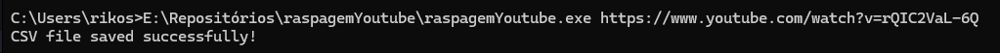

Esse é um extrator de comentário de vídeos de youtube
FUNCIONAL NO DIA 10/03/2024

*quaisquer mudanças que o google realizar no youtube pode tornar a ferramenta obsoleta*

npm install

COMO USAR

```
function test() {
  console.log("node index.js youtube_link");
}
```


para criar um executável 

```
function test() {
  console.log("nexe -i index.js -o raspagemYoutube.exe --build --verbose");
}
```

abra o executavel no cmd 



a saída é um arquivo CSV com as colunas
"user","isReply","upVotes","comment"

onde:
- user: é o usuário que fez o comentário
- isReply: se o comentário é resposta para outro comentário, se for false é o comentário principal e todo true abaixo dele é uma resposta a esse
- upVotes: quantos upvotes esse comentário tem
- comment: O texto do comentário